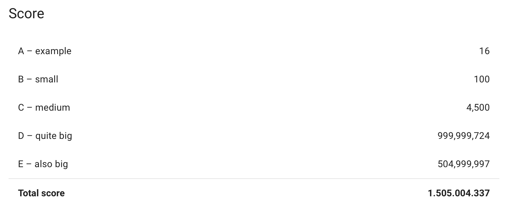

# Hash-Code-Practice-Round
Solving Hash Code Practice round using Python language. The results obtained using the second algorithm:

After trying the Python language, the algorithm was improved adding some mutations to the results, deleting some unnecessary loops and converting the code to Java. The algorithm improved its execution time dramatically and it also got the best possible score.
